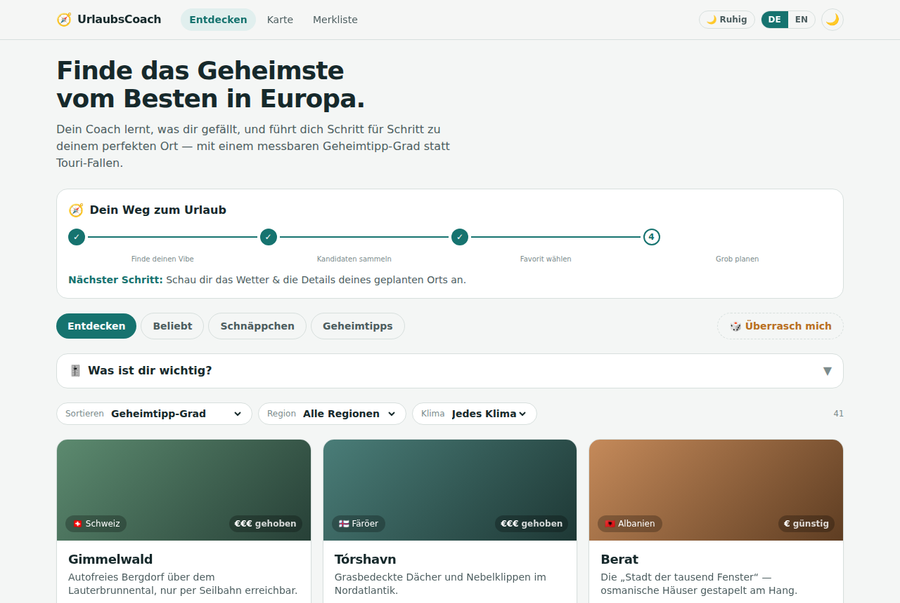
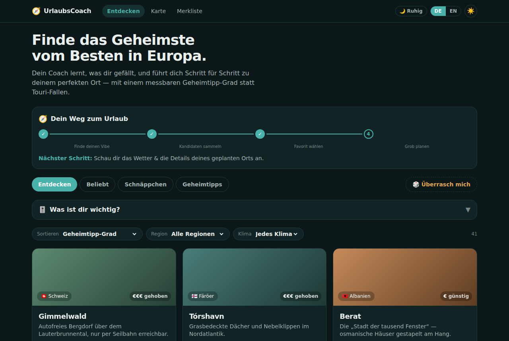
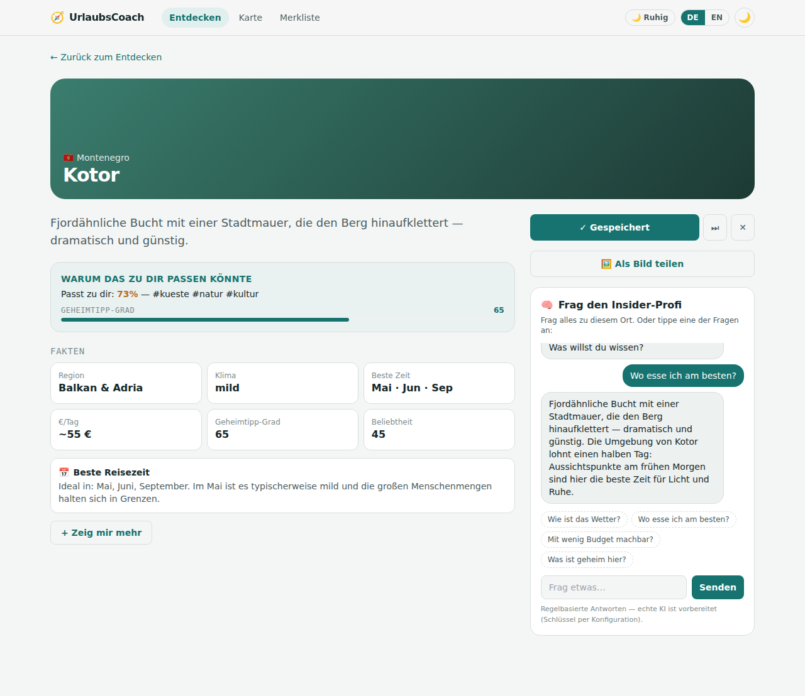
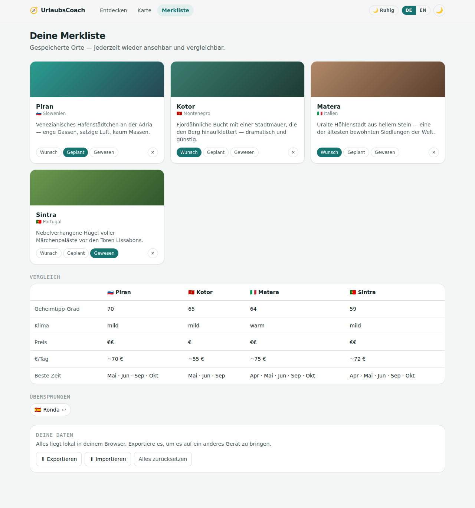
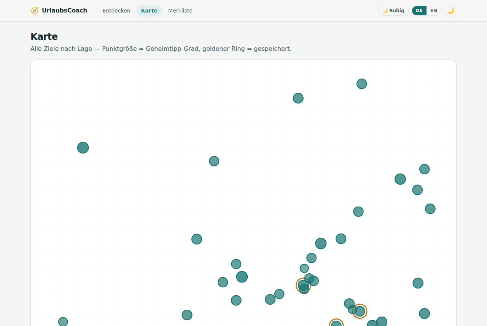
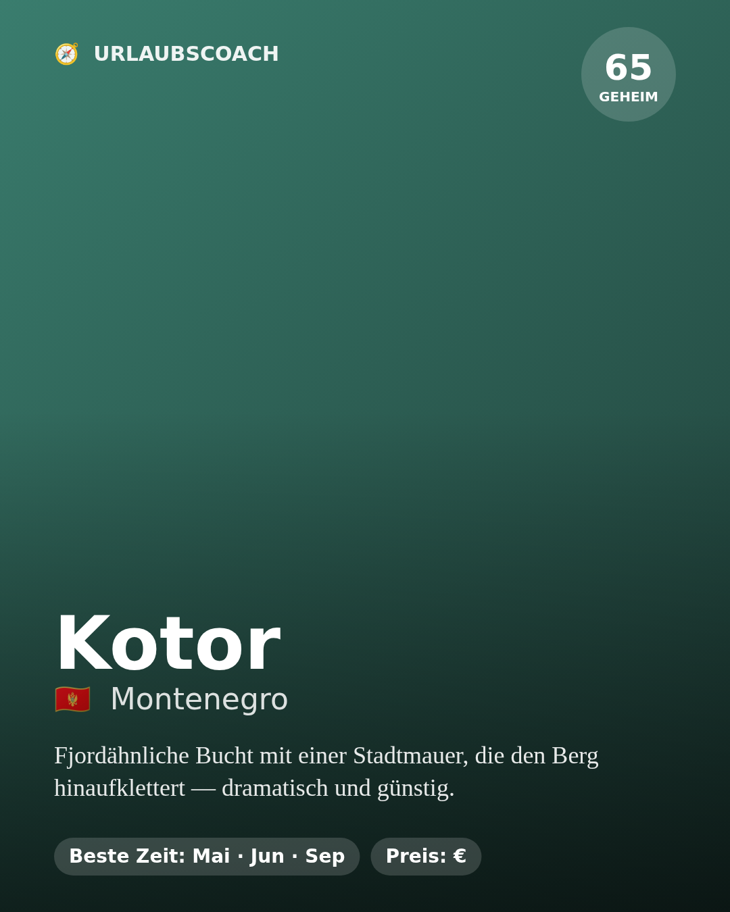

# UrlaubsCoach🧭 (noch nicht endgültig fertig)

Dein persönlicher Reise-Coach als Web-App: finde **das Geheimste vom Besten in Europa** —
mit messbarem Geheimtipp-Grad, lernenden Vorlieben, Insider-Chat, Merkliste, Karte und
teilbaren Bildkarten. Deutsch & Englisch, Hell-/Dunkelmodus, Profi-Design.

> Status: **Etappe 1 vollständig gebaut** (M1–M13). Lokal-first (keine Konten/Server nötig),
> KI-Chat als regelbasierte Engine (KI-bereit), Daten als Seed mit Live-Wetter.

- **Konzept:** [`KONZEPT.md`](./KONZEPT.md) — der A-bis-Z-Plan, von vier Fach-Perspektiven geschärft
- **Markt-Strategie:** [`STRATEGIE.md`](./STRATEGIE.md) — Keil, MVP, Geld-Modell, Recht
- **Bau-Fahrplan:** [`PLAN.md`](./PLAN.md) — die 13 Meilensteine (alle ✅)

## Vorschau

**Entdecken** — hell & dunkel, mit Coach-Panel, Reitern und Geheimtipp-Grad:

<p>
  
  
</p>

**Ortsdetail** — Fakten, „warum das zu dir passt", Perspektiven-Motor, Bildkarte & Insider-Chat:



**Merkliste mit Vergleich** & **Europa-Karte** (Pin-Größe = Geheimtipp-Grad):

<p>
  
  
</p>

**Teilbare Bildkarte** (Canvas → PNG, Präsentationsqualität):



## Features

- 🧭 **Entdecken** von 42 europäischen Zielen mit Reitern: **Entdecken · Beliebt · Schnäppchen · Geheimtipps**
- 💎 **Geheimtipp-Grad** (0–100) = Qualität × Bekanntheit × regionaler Kontrast — sortier- & filterbar
- 🎚️ **Vorlieben-Profil**, das der Coach **still mitlernt** (Speichern zieht hin, „Nichts für mich" weg)
- 🗂️ **Speichern / Überspringen / Nichts für mich** an jeder Karte; **Merkliste** mit Status (Wunsch / Geplant / Gewesen)
- 🌙🚀 **Zwei Modi**: Ruhig (der Coach führt) ↔ Profi (volles Cockpit mit Score-Aufschlüsselung)
- ♾️ **„Nie leer"-Motor** auf den Ortsseiten: „Zeig mir mehr" liefert immer einen neuen, konkreten Blickwinkel
- 🧠 **Insider-Chat** pro Ort (regelbasiert, gegroundet auf Ortsdaten; echte KI ist über `askInsider()` vorbereitet)
- 🌡️ **Live-Wetter** über Open-Meteo (client-seitig, mit sauberem Fallback)
- 🗺️ **Europa-Karte** mit Pins (Größe = Geheimtipp-Grad) + **Vergleichstabelle** gespeicherter Orte
- 🖼️ **Teilbare Bildkarten** (Canvas → PNG) in Präsentationsqualität
- 🧭 **Onboarding** + „Weg zum Urlaub"-Coach (nächster Schritt statt Brainfog)
- 🔎 **SEO**: server-gerenderte Ortsseiten, `sitemap.xml`, `robots.txt`, Open Graph, JSON-LD
- 🔐 **Lokal-first**: Daten nur im Browser; **Export / Import / Reset** in der Merkliste
- 🌍 **Deutsch/Englisch** umschaltbar, **Hell-/Dunkelmodus**, Tastatur-Fokus, 404-Seite

Datenwerte (Beliebtheit/Qualität) sind aktuell handgesetzte Anhaltspunkte (Seed) und werden in
einer späteren Etappe aus offenen Quellen (Wikipedia-Seitenaufrufe, Wikidata, OSM) berechnet.

## Technik

Next.js 14 (App Router) · React 18 · TypeScript · Tailwind CSS. Ohne externe UI-Abhängigkeiten,
skalierbar aufgebaut (Seiten statisch vorgerendert).

## Lokal starten

```bash
npm install
npm run dev      # Entwicklungsserver auf http://localhost:3000
```

Produktions-Build:

```bash
npm run build && npm start
```

Optional per Umgebungsvariable: `NEXT_PUBLIC_SITE_URL` (für Sitemap/Canonical-URLs).

## Projektstruktur

```
src/
  app/            Seiten: Entdecken (/), Karte (/karte), Merkliste (/dashboard),
                  Ortsdetail (/place/[id]), Rechtliches, sitemap.ts, robots.ts
  components/     UI: Karten, Explorer, Coach-Panel, Onboarding, Chat, Karte,
                  Bildkarte, Wetter, Daten-Export …
  data/           Datensatz europäischer Ziele
  lib/            Scoring (Geheimtipp-Grad, Match, Lernen), Perspektiven-Engine,
                  Chat-Engine, Bildkarten-Renderer, Wetter, Merkliste-Store
  i18n/           Deutsch/Englisch
```

## Bewusst für später vorbereitet

- 🔑 **Echte KI im Chat** — Nahtstelle `lib/chatEngine.ts → askInsider()`, nur Schlüssel eintragen
- 👤 **Echtes Konto/Backend** — heute lokal-first mit Export/Import als Brücke
- 💶 **Echte Live-Preise** — via Affiliate-Deeplinks / Amadeus (siehe `STRATEGIE.md`)

## Lizenz & Quellen

Wetter: Open-Meteo (CC BY 4.0) · Kartendaten: © OpenStreetMap-Mitwirkende (ODbL) ·
Ortsfakten: Wikidata (CC0). Siehe `/rechtliches` in der App.
